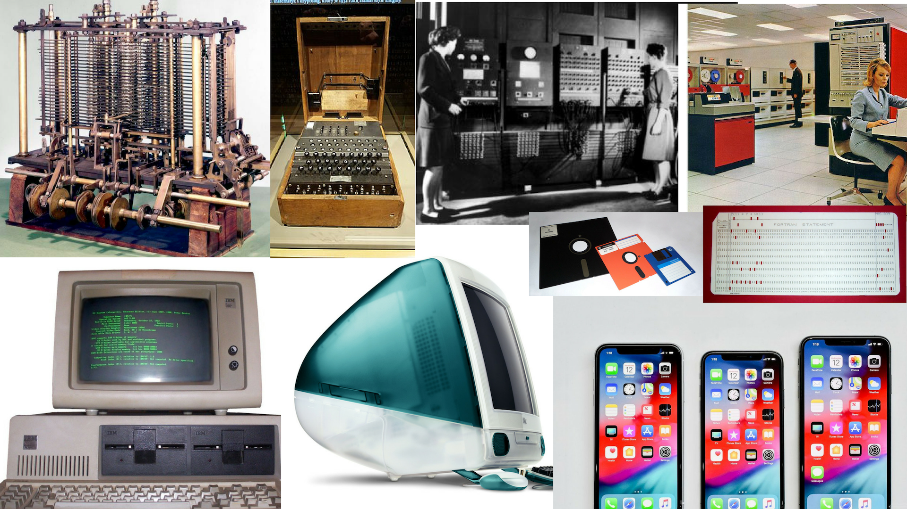

@title[Welcome to Coding 101]
## Welcome to Coding 101
*Learning the FUNdamentals of coding*

--- 
##### Hi! I'm Zoe
Digital Humanities Developer at the Scholars' Lab at University of Virginia 
http://scholarslab.org/
Feel free to email me if you have any questions at zgl3n@virginia

Note: a bit about me
---
# Today's Agenda
- Start with an introduction to coding and computers |
- Then jump into writing some code with the command line |
- Then we'll do an introduction to Python |
- Followed by more complex ways of writing code |
- Finally you'll be writing your own scripts in Python |

---
# Code of Conduct
- No wrong questions |
- Ask for help using stickies |
- Be respectful |
- Be helpful |
- Try your best and keep an open mind |

---?image=https://media.giphy.com/media/l3vRfhFD8hJCiP0uQ/giphy.gif

--- 
# So what is coding?
---?image=https://media.giphy.com/media/eCqFYAVjjDksg/giphy.gif

---?image=https://media.giphy.com/media/m0Z1LPu6flQDS/giphy.gif

---
### What is a computer even?

[Paul Ford **What is Code?**](https://www.bloomberg.com/graphics/2015-paul-ford-what-is-code/#lets-begin)

Note: series of clocks/switches doing millions of computation. But how does it know what to do? We tell it with inputs! like a keyboard scroll down to keyboard visualization. But how does what we input turn into something the computer understands?

---?image=https://media.giphy.com/media/zXmbOaTpbY6mA/giphy.gif

---
### Binary 
# 0 & 1
- Way of counting, just like our way of counting that uses the digits 0-9 |
- Turns our commands into machine readable language | 
- ["Bits, Bytes, Building With Binary" by Vaidehi Joshi, BaseCS Blog](https://medium.com/basecs/bits-bytes-building-with-binary-13cb4289aafa) |
---

### Brief History of Computers

brief history
computing didn't always look like your phone
abacus
WWII enigma machine
punch cards
a lot has changed but a lot hasn't
still fundamentally about 
### Women and Computers
- women have been doing computing for a long time
- Ada Lovelace
Grace Hopper
Bletchley Park

---
### So what is code?
tell the computer how to do what you want it do
can be anything from saving a file to 
can be done in multiple different ways
but needs to be executed -> transformed into a machine language -> becomes software
we do this with something called compilers
compilers translate what we've written back into binary and then the computer executes those commands
---
- Who can code?
YOU!
no literally you can code! and after today you'll officially be a coder
all of coding is creating logic and getting a computer to execute it -> sounds simple but feels magical
